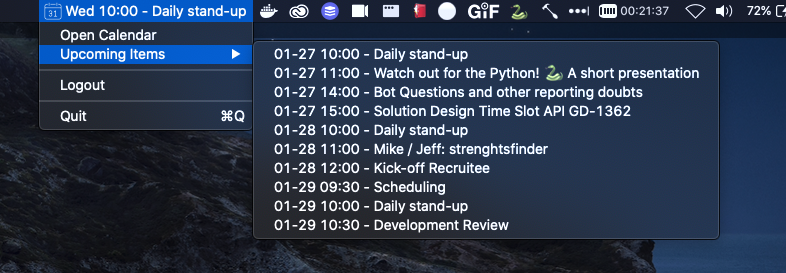

Caddy
=====

A macOS app to display your next meeting item in the MacOS toolbar. 

Features:

- Authenticate using Google Calendar.
- Displays your next meeting in the MacOS Toolbar.
- Sends a push notification with the Google Meet link 2 minutes before the start of the meeting.
- Display your upcoming 10 meetings.
- Quickly navigate to agenda items and your agenda.

Dependencies:

- rumps
- google-api-python-client
- google-auth-httplib2
- google-auth-oauthlib
- python-dateutil

TO-DO
-----

- Add the functionality to decline/accept upcoming meeting. 
- Add an option to easily add your own credentials.json.
- Support more join links like:
    - Microsoft Teams
    - Zoom
- Add a button to view the description of an invite.
- Add a blink option if the meeting has started but you didn't click the notification.
- Configure notification timer minutes. 

Development
-----------

To get started create a virtualenv and install requirements:

    python3 -m venv env --copies
   
If you're using pyenv to manage your environments make sure to install using, otherwise you could run into issues 
building the .app file.  

    env PYTHON_CONFIGURE_OPTS="--enable-framework" pyenv install -v 3.9.1
    
Install the requirements
    
    pip install -r requirements.txt
    
Run the app, this will start the application and display all the logger statements in the console.

    python app.py

Building
--------
 
Create App:

    python3 setup.py py2app

Test a build:

    ./dist/Caddy.app/Contents/MacOS/Caddy

